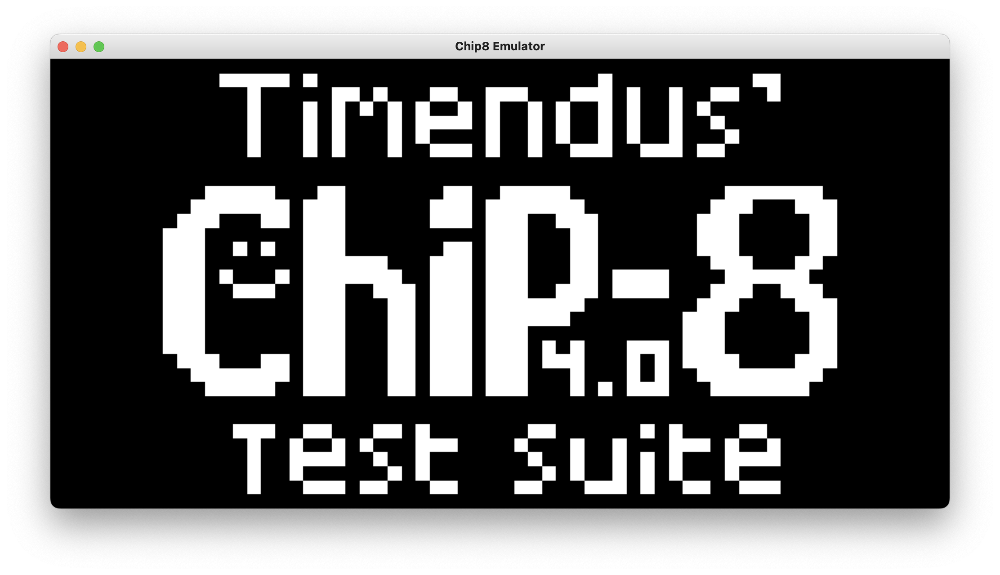

# Chip8 Emulator

This is a chip8 emulator written in C++20. The only external dependency is SDL2. It passes all of the tests in the Timendus test rom and implements most of the chip8 quirks. Includes a quick and dirty little sin wave synthesizer for the sound generation and a bunch of stolen roms to play with.

#### Building
* Requires CMake, a C++20 compiler, and SDL2

#### Controls

* Tab - Switch between roms (looks for a `./roms/` directory)
* Space - Pause/Resume
* Right Arrow - Step one instruction at a time
* 1,2,3,4,q,w,e,r,a,s,d,f,z,x,c,v - Hex Keypad